&nbsp; | &nbsp;
:-:|:-
  | *jan*
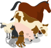 | *soweli*
|-
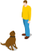   | jan li *lukin* e soweli.
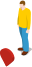 | jan li lukin e *ijo*.
|-
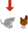 | *ni* li soweli.
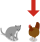 | ni li *waso*.
|-
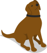     | ni li soweli *wan*.
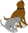 | ni li soweli *tu*.
 | ni li soweli *mute*.
|-
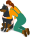 | jan li *pilin* e soweli.
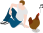  | jan li *kute* e waso.
|-
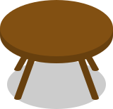            | ni li *supa*.
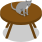     | soweli li *lon* supa.
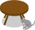 | soweli li lon supa *ala*.
|-
  | ni li *meli*.
    | ni li *mije*.
|-
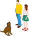  | mije li lukin e soweli.  meli li lukin e soweli *sama*.
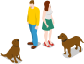 | mije li lukin e soweli.  meli li lukin e soweli *ante*.
|-
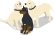   | soweli tu li *sama*.  soweli wan li *ante*.
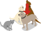 | soweli ni li *sama* soweli ante tu.
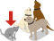  | soweli ni li *sama* soweli ante ala.
|-
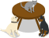 | soweli wan li lon supa.  soweli ante li lon supa ala.
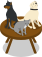  | soweli *ale* li lon supa.
|-
 | soweli li lon *poka* supa.
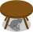  | soweli li lon *anpa* supa.
|-
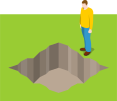    | mije li lukin e *lupa*.
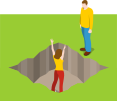 | meli li lon *insa* lupa.  mije li lukin e meli lon *insa* lupa.
|-
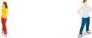  | mije li *weka tan* meli.  meli li *weka tan* mije.
 | mije li *weka ala tan* meli.  meli li *weka ala tan* mije.
|-
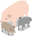 | soweli wan li *suli*.  soweli tu li *suli* ala.  soweli tu li *lili*.
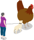    | waso li suli *mute*.
|-
soweli li suli. 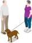 | mije li *toki*.  mije li *toki tawa* meli.  mije li *toki* soweli tawa meli.  mije li *toki e ni:* zzzz "soweli li suli."
|-
soweli li suli.  | mije li toki e *nimi*.
 soweli li suli.  soweli li lili ala. | meli li toki e *nimi* mute.
|-
 ni li soweli. | meli li toki e ni: zzzz "ni li soweli."  ni li *lon*.
ni li waso.  | mije li toki e ni: zzzz "ni li waso."  ni li *lon ala*.
|-
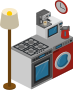      | ni li *ilo*.
  | jan li *jo* e ilo.
 | meli li jo e *wan* ilo.  mije li jo e *wan* ilo ante.
|-
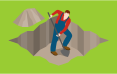 | jan li *pali*.  jan li *pali* e lupa.  jan li *pali* e lupa *kepeken* ilo.
|-
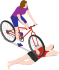  | meli li pali e ijo *ike* tawa mije.  meli li pali e *ijo+ike* tawa mije.
 | meli li pali e ijo *pona* tawa mije.  meli li pali e *ijo+pona* tawa mije.
|-
  | jan li *pilin* ike.  jan li *pilin+ike*.
 | jan li *pilin* pona.  jan li *pilin+pona*.
|-
 | *kala* tu li *lon*.  *kala* wan li *moli*.
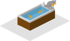  | soweli li pali e ijo ike tawa kala.  kala li moli *tan* ni.
|-
   | mije li *pilin e ni:* zzzz meli li lon lupa.
 | mije li *sona* e ijo meli.  mije li *sona e ni:* zzzz meli li lon lupa.  mije li *sona* tan ni: zzzz mije li lukin e meli lon lupa.
|-
 | jan li jo e *pan*.
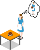 | jan li *wile* jo e pan.
|-
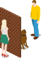 | mije li *ken* lukin e soweli.  meli li *ken ala* lukin e soweli.
|-
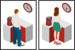 | mije li lukin e ilo.  *tenpo kama la* meli li lukin e ilo.
|-
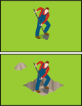 | *tenpo lili la* jan li pali.
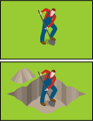  | *tenpo suli la* jan li pali.
|-
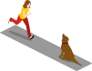 | jan li *tawa*.  jan li *tawa* soweli.
{: .handout}

  <a href="lipu-nimi">o tawa lipu+nimi!</a>

